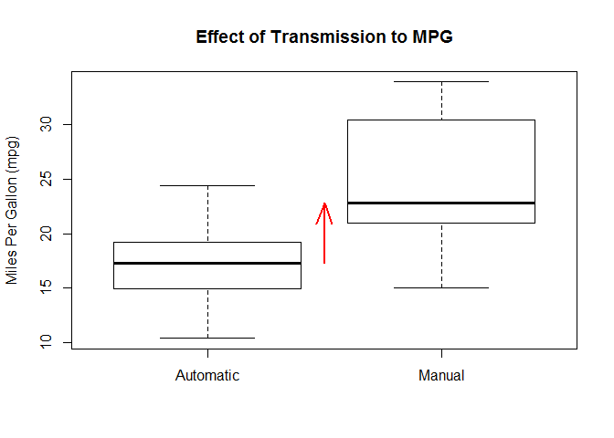
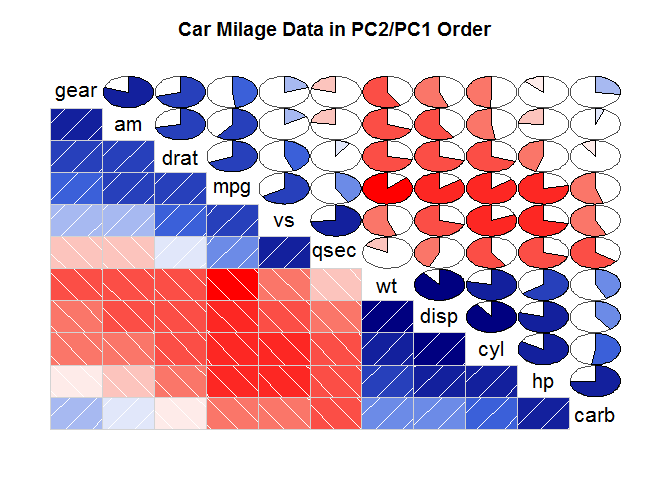
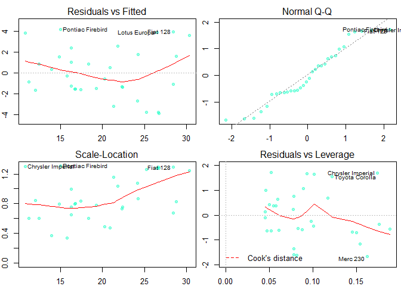

# Motor Trend
Chandrasekar Ganesan  
March 27, 2017  

#Instructions

You work for Motor Trend, a magazine about the automobile industry. Looking at a data set of a collection of cars, they are interested in exploring the relationship between a set of variables and miles per gallon (MPG) (outcome). They are particularly interested in the following two questions:

* “Is an automatic or manual transmission better for MPG”
* "Quantify the MPG difference between automatic and manual transmissions"


#Load the Data


```r
data(mtcars)
summary(mtcars)
```

```
##       mpg             cyl             disp             hp       
##  Min.   :10.40   Min.   :4.000   Min.   : 71.1   Min.   : 52.0  
##  1st Qu.:15.43   1st Qu.:4.000   1st Qu.:120.8   1st Qu.: 96.5  
##  Median :19.20   Median :6.000   Median :196.3   Median :123.0  
##  Mean   :20.09   Mean   :6.188   Mean   :230.7   Mean   :146.7  
##  3rd Qu.:22.80   3rd Qu.:8.000   3rd Qu.:326.0   3rd Qu.:180.0  
##  Max.   :33.90   Max.   :8.000   Max.   :472.0   Max.   :335.0  
##       drat             wt             qsec             vs        
##  Min.   :2.760   Min.   :1.513   Min.   :14.50   Min.   :0.0000  
##  1st Qu.:3.080   1st Qu.:2.581   1st Qu.:16.89   1st Qu.:0.0000  
##  Median :3.695   Median :3.325   Median :17.71   Median :0.0000  
##  Mean   :3.597   Mean   :3.217   Mean   :17.85   Mean   :0.4375  
##  3rd Qu.:3.920   3rd Qu.:3.610   3rd Qu.:18.90   3rd Qu.:1.0000  
##  Max.   :4.930   Max.   :5.424   Max.   :22.90   Max.   :1.0000  
##        am              gear            carb      
##  Min.   :0.0000   Min.   :3.000   Min.   :1.000  
##  1st Qu.:0.0000   1st Qu.:3.000   1st Qu.:2.000  
##  Median :0.0000   Median :4.000   Median :2.000  
##  Mean   :0.4062   Mean   :3.688   Mean   :2.812  
##  3rd Qu.:1.0000   3rd Qu.:4.000   3rd Qu.:4.000  
##  Max.   :1.0000   Max.   :5.000   Max.   :8.000
```

#Exploratory Analysis


```r
temp <- mtcars
temp$am <- as.factor(temp$am)
levels(temp$am) <- c("Automatic","Manual")
plot(temp$am, temp$mpg, ylab="Miles Per Gallon (mpg)",
     main="Effect of Transmission to MPG")

mauto <- median(temp[temp$am=="Automatic",]$mpg)
mman <- median(temp[temp$am=="Manual",]$mpg)

arrows(1.5,mauto, 1.5, mman, lty=1, lwd=2, col="red", length=0.25, angle=20)
```

<!-- -->

As it can be clearly seen, that **mgp** is higher in vehicles with manual transmission when compared to vehicles with Automatic transmission.

#Deeper Dive

#Hypothesis

Let's define a two sided hypothesis test as follows:

1) **H0** - Miles per gallon is not influenced by automatic or manual transmission (null hypothesis)
2) **H1** - Miles per gallon is influenced by automatic or manual transmission

Let's quantify the variation via regression analysis.

Understanding the correlations of mtcars dataset


```r
data(mtcars)
library(corrgram)
```

```
## Warning: package 'corrgram' was built under R version 3.3.3
```

```r
corrgram(mtcars, order=TRUE, lower.panel=panel.shade,
   upper.panel=panel.pie, text.panel=panel.txt,
   main="Car Milage Data in PC2/PC1 Order")
```

<!-- -->

It is evident that **mpg** is highly correlated with **gear, am, wt, disp, cyl, hp** and **qsec**

But it is imperative we reduce the variable set to avoid overfitting or underfitting.

Let's use elimination process to remove unrelated variables. Do a multi variable regression with mpg as outcome based on all variables.


```r
fit <- lm(mpg ~ ., data=mtcars)
summary(fit)$coef
```

```
##                Estimate  Std. Error    t value   Pr(>|t|)
## (Intercept) 12.30337416 18.71788443  0.6573058 0.51812440
## cyl         -0.11144048  1.04502336 -0.1066392 0.91608738
## disp         0.01333524  0.01785750  0.7467585 0.46348865
## hp          -0.02148212  0.02176858 -0.9868407 0.33495531
## drat         0.78711097  1.63537307  0.4813036 0.63527790
## wt          -3.71530393  1.89441430 -1.9611887 0.06325215
## qsec         0.82104075  0.73084480  1.1234133 0.27394127
## vs           0.31776281  2.10450861  0.1509915 0.88142347
## am           2.52022689  2.05665055  1.2254035 0.23398971
## gear         0.65541302  1.49325996  0.4389142 0.66520643
## carb        -0.19941925  0.82875250 -0.2406258 0.81217871
```

Looking at the result **cyl** has a high P value of **0.91608738**. Let's eliminate this and rerun the regression with the rest as follows:


```r
fit <- lm(mpg ~ disp+hp+drat+wt+qsec+vs+am+gear+carb, data=mtcars)
summary(fit)$coef
```

```
##                Estimate  Std. Error    t value   Pr(>|t|)
## (Intercept) 10.96007405 13.53030251  0.8100391 0.42659327
## disp         0.01282839  0.01682215  0.7625891 0.45380797
## hp          -0.02190885  0.02091131 -1.0477031 0.30615002
## drat         0.83519652  1.53625251  0.5436584 0.59214373
## wt          -3.69250814  1.83953550 -2.0073046 0.05715727
## qsec         0.84244138  0.68678068  1.2266527 0.23291993
## vs           0.38974986  1.94800204  0.2000767 0.84325850
## am           2.57742789  1.94034563  1.3283344 0.19768373
## gear         0.71155439  1.36561933  0.5210489 0.60753821
## carb        -0.21958316  0.78855537 -0.2784626 0.78325783
```

We repeat the process recursively until we get a model with dependent variables that has P value < 0.05

The model variables that impacts **mpg** are **wt, qsec, am** as shown below. Let's run the final regression on the selected dependent variables.


```r
fit <- lm(mpg ~ wt+qsec+am -1, data=mtcars)
summary(fit)$coef
```

```
##       Estimate Std. Error   t value     Pr(>|t|)
## wt   -3.185455  0.4827586 -6.598442 3.128844e-07
## qsec  1.599823  0.1021276 15.664944 1.091522e-15
## am    4.299519  1.0241147  4.198279 2.329423e-04
```

Observe that P-value for **am** is 2.329423e-04, much less than 0.05. We have enough evidence to reject the null hypothesis *(H0)*

#Exploring Results


```r
par(mfrow=c(2,2), mar=c(2,2,2,.5), font.main=1, font.sub=1, cex.lab=1, cex.axis=1)
plot(fit, cex=0.8, pch=19, col=rgb(0,1,.75,0.4))
```

<!-- -->

#Conclusion

Our plot is not showing any pattern. The linear model we have is a reasonable fit.

Let's quantify the MPG difference between *automatic* and *manual transmission*


```r
coefs <- summary(fit)$coef
mpgRange <- coefs["am",1] + c(-1,1) * qt(0.975, df = fit$df) * coefs["am",2]
print(mpgRange)
```

```
## [1] 2.204969 6.394069
```

Based on 95% confidence, we can estimate that *switching to manual transmission from automatic transmission will result in an average of 2.2 to 6.4 miles per gallon*.

Hence manual transmission is **better** than automatic transmission


